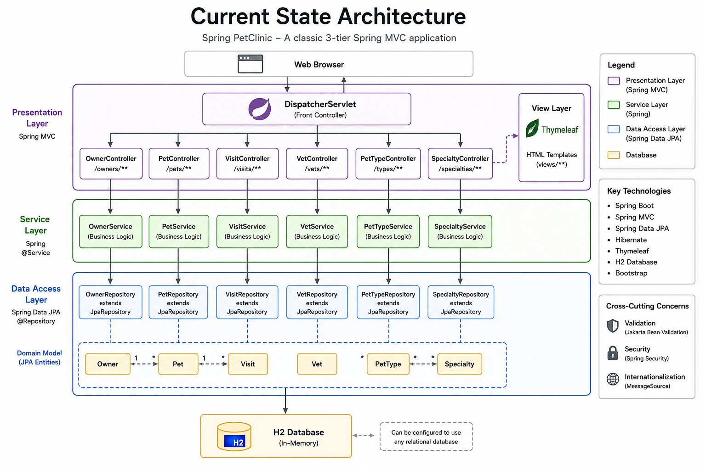

# Current-State Architecture

This page documents the Module 1 on-premise baseline architecture for the Spring PetClinic assessment application. The local workstation is used as the on-premise VM simulation host, with the application running as a Spring Boot monolith and exposed through local HTTP ingress on port `8081`.

Port `8081` is used because Jenkins was already running on port `8080` in the baseline environment. The diagram captures the current runtime shape before Azure migration changes are introduced.

## Architecture Summary

| Area | Current-state detail |
|---|---|
| User ingress | Browser access over HTTP to `localhost:8081` |
| Host pattern | Local machine representing an on-premise VM simulation |
| Application tier | Spring PetClinic Spring Boot monolith running with Java and Maven wrapper |
| Database tier | Local development database behavior under the default Spring profile |
| File and disk dependencies | Local source tree, configuration files, logs and static resources |
| Existing operational dependency | Jenkins uses `localhost:8080`, so the application baseline runs on `8081` |
| Auth provider | No LDAP, OIDC or enterprise auth provider identified in Module 1 |
| External APIs and SMTP | No third-party API or SMTP dependency identified in Module 1 |
| Operations path | Git, Maven wrapper, PowerShell/browser and local log capture |

## Key Flows

| Flow | Description |
|---|---|
| Browser to app | User browser reaches Spring PetClinic through local HTTP ingress on port `8081` |
| App to database | Application uses local development database behavior for Module 1 baseline validation |
| App to local disk | Application source, configuration, logs and static resources reside on local disk |
| Operations to host | Operator uses Git, Maven wrapper, command line and browser checks to build, run and validate the app |

## Assumptions

| Assumption | Follow-up for enterprise migration |
|---|---|
| Local workstation is acceptable as an on-premise VM simulation for this hands-on assessment | Replace with actual VM OS, runtime, firewall, storage and dependency facts for a real migration |
| Module 1 baseline does not show enterprise auth, SMTP or external API calls | Reconfirm using app owner interviews, network flow logs and discovery tooling |
| Default local database behavior is sufficient for the initial baseline | Use Module 2 and Module 8 evidence for formal database dependency and migration planning |
