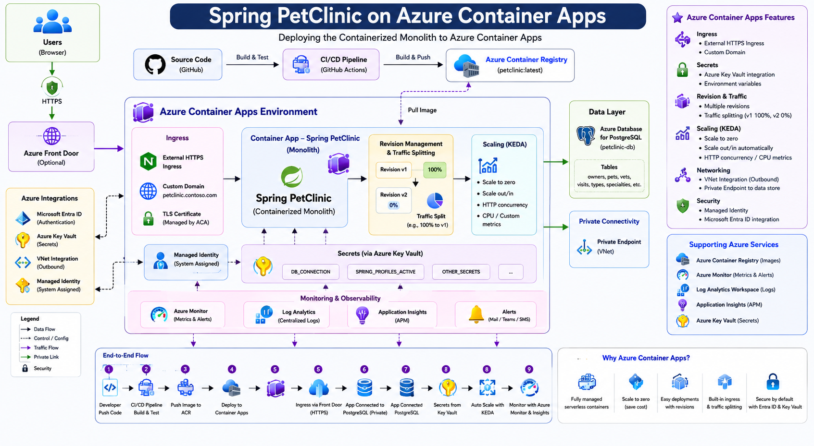

# Replatform Container Apps Architecture

This page documents the Module 7 replatform target architecture for running the containerized Spring PetClinic monolith on Azure Container Apps. The design keeps the application as a single containerized workload while moving runtime hosting, HTTPS ingress, scaling and operational telemetry to managed Azure services.

Azure Container Apps was selected because it provides a managed container runtime, built-in external ingress, revision traffic management, replica scaling, managed identity support and simplified operations compared with running the same container on a VM or managing an AKS cluster for this assessment scope.

## Architecture Summary

| Area | Target-state detail |
|---|---|
| Managed runtime | Azure Container Apps hosts the Spring PetClinic container image |
| Image source | Azure Container Registry stores and serves the versioned application image |
| Ingress | Container Apps external HTTPS ingress exposes the application endpoint |
| Container port | Application listens on port `8081` inside the container app |
| Revision traffic | Single active revision receives 100% of traffic for Module 7 validation |
| Scaling | Minimum one replica and maximum two replicas for the assessment deployment |
| Identity | User-assigned managed identity is used for ACR pull access |
| Secrets | Container App secrets hold runtime values; future database and TLS values follow the same pattern |
| Observability | Azure Monitor and Log Analytics collect platform and application telemetry |

## Key Flows

| Flow | Description |
|---|---|
| User to app | User accesses the public Container Apps HTTPS endpoint |
| Container Apps to ACR | Managed identity pulls the Spring PetClinic container image from Azure Container Registry |
| Pipeline to target | CI/CD builds, tags and pushes the image, then deploys the Container App revision |
| App to logs | Application and platform telemetry flow to Log Analytics |
| App to temporary database | Module 7 validation uses the default H2-backed runtime before the managed database cutover module |

## Operational Notes

| Topic | Note |
|---|---|
| VM comparison | Removes VM patching and manual runtime installation from the application hosting path |
| App Service comparison | Gives a more container-native revision and scaling model than App Service for Containers |
| AKS comparison | Avoids cluster administration while still supporting containerized deployment and ingress |
| Future hardening | Add private networking, Key Vault references, managed PostgreSQL connectivity and stricter egress controls for production |
