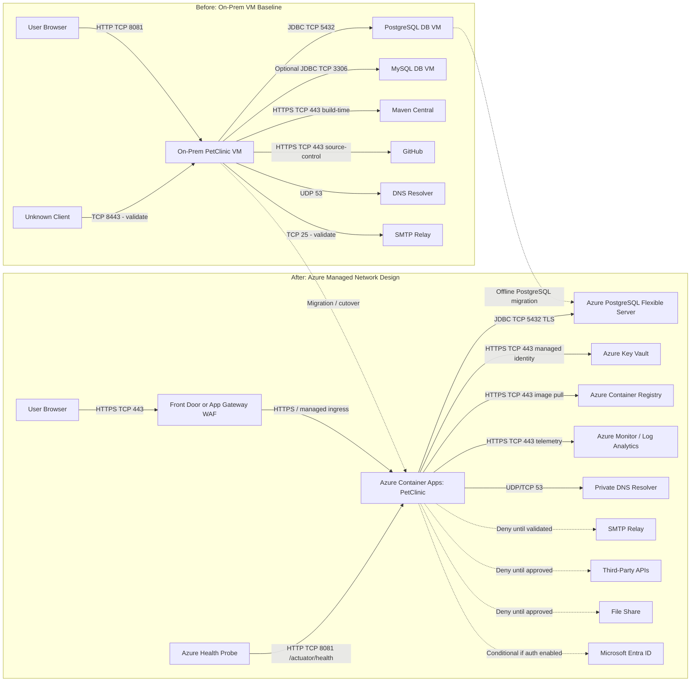

# Before And After Network Dependency Map

```mermaid
flowchart LR
  subgraph Before["Before: On-Prem VM Baseline"]
    UserBefore["User Browser"] -->|"HTTP TCP 8081"| OnPremVm["On-Prem PetClinic VM"]
    UnknownClient["Unknown Client"] -->|"TCP 8443 - validate"| OnPremVm
    OnPremVm -->|"JDBC TCP 5432"| PgVm["PostgreSQL DB VM"]
    OnPremVm -->|"Optional JDBC TCP 3306"| MySqlVm["MySQL DB VM"]
    OnPremVm -->|"HTTPS TCP 443 build-time"| Maven["Maven Central"]
    OnPremVm -->|"HTTPS TCP 443 source-control"| GitHub["GitHub"]
    OnPremVm -->|"UDP 53"| DnsBefore["DNS Resolver"]
    OnPremVm -->|"TCP 25 - validate"| SmtpBefore["SMTP Relay"]
  end

  subgraph After["After: Azure Managed Network Design"]
    UserAfter["User Browser"] -->|"HTTPS TCP 443"| Edge["Front Door or App Gateway WAF"]
    Edge -->|"HTTPS / managed ingress"| ContainerApp["Azure Container Apps: PetClinic"]
    PlatformProbe["Azure Health Probe"] -->|"HTTP TCP 8081 /actuator/health"| ContainerApp
    ContainerApp -->|"JDBC TCP 5432 TLS"| AzurePg["Azure PostgreSQL Flexible Server"]
    ContainerApp -->|"HTTPS TCP 443 managed identity"| KeyVault["Azure Key Vault"]
    ContainerApp -->|"HTTPS TCP 443 image pull"| Acr["Azure Container Registry"]
    ContainerApp -->|"HTTPS TCP 443 telemetry"| Monitor["Azure Monitor / Log Analytics"]
    ContainerApp -->|"UDP/TCP 53"| PrivateDns["Private DNS Resolver"]
    ContainerApp -. "Deny until validated" .-> SmtpAfter["SMTP Relay"]
    ContainerApp -. "Deny until approved" .-> ThirdParty["Third-Party APIs"]
    ContainerApp -. "Deny until approved" .-> FileShare["File Share"]
    ContainerApp -. "Conditional if auth enabled" .-> Entra["Microsoft Entra ID"]
  end

  OnPremVm -. "Migration / cutover" .-> ContainerApp
  PgVm -. "Offline PostgreSQL migration" .-> AzurePg
```
