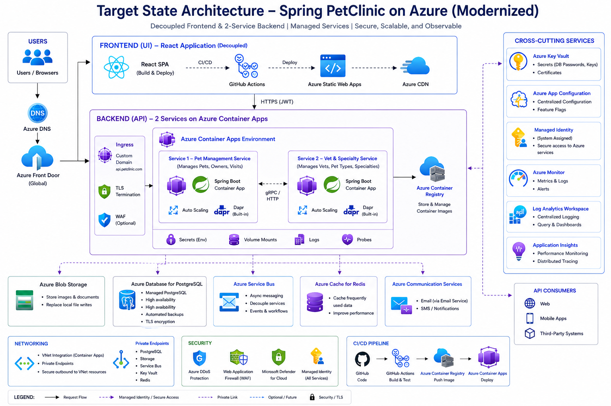

# Reengineered Runtime Configuration Architecture

This page documents the Module 10 modernization of one monolith concern: runtime configuration and feature flags. The application keeps its Spring Boot monolith shape, but non-secret runtime values move to an Azure App Configuration pattern while database secrets remain protected through Azure Key Vault.

The design reduces hardcoded configuration drift, gives operations a central place to manage runtime values, and keeps the blast radius small because the application code change is limited to safe runtime metadata and configuration binding.

## Components

| Component | Role |
|---|---|
| Azure App Configuration | Central store for non-secret runtime values and feature flags |
| Azure Key Vault | Secret authority for database connection values |
| Azure Container Apps | Managed container runtime for PetClinic |
| Azure PostgreSQL Flexible Server | Managed database target selected in Module 8 |
| Azure Monitor | Logs, metrics and validation evidence |

## Network Dependency Added By Module 10

| Source | Destination | Protocol | Control |
|---|---|---|---|
| Azure Container Apps environment | Azure App Configuration endpoint | HTTPS `443` | Managed identity, private endpoint or Azure Firewall application rule |
